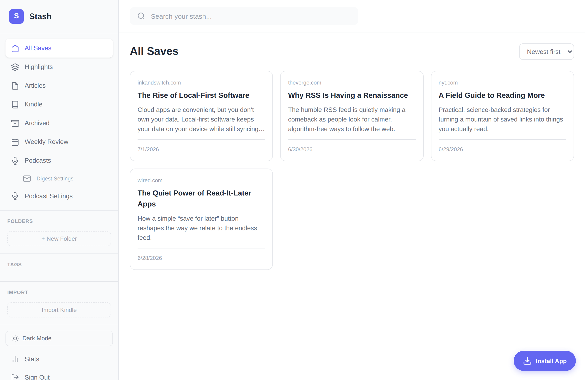
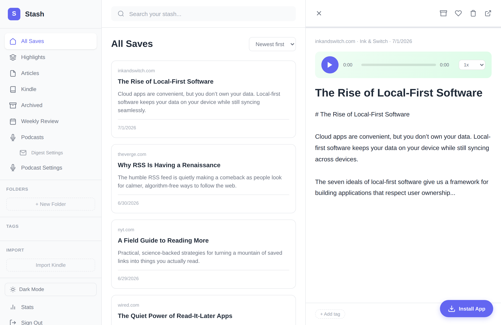
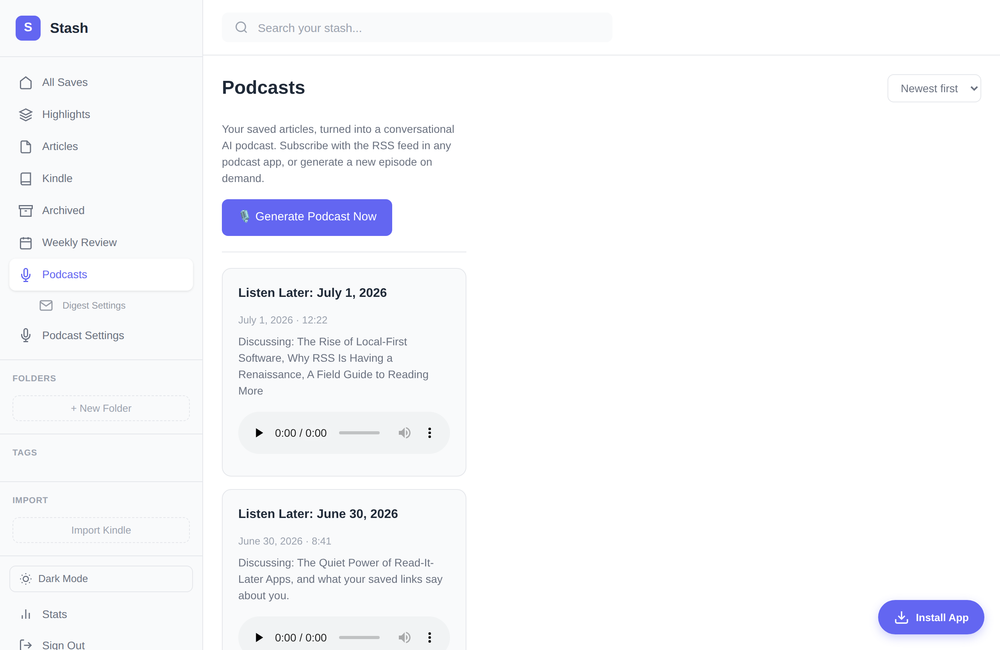
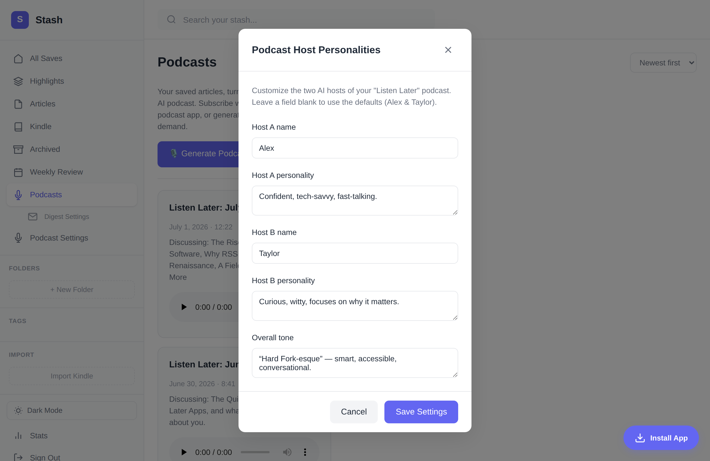

# Stash

A simple, self-hosted read-it-later app. Save articles, highlights, and Kindle notes to your own database.

**Your data. Your server. No subscription.**

## Features

- **Chrome & Firefox Extensions** - Save pages and highlights with one click
- **Web App** - Access your saves from any device
- **Kindle Sync** - Import highlights from your Kindle library
- **CSV Import** - Bring your reading list over from Pocket, Instapaper, Omnivore, and other read-it-later services
- **Full-Text Search** - Find anything you've saved
- **Text-to-Speech** - Basic audio generation (Edge TTS)
- **Listen Later** - Turn your saved articles into a conversational AI podcast with an RSS feed
- **YouTube Transcripts** - Save a YouTube video and its transcript becomes a Listen Later input, just like an article
- **iOS Shortcut** - Save from Safari on iPhone/iPad
- **Bookmarklet** - Works in any browser

## Why Stash?

- **Free forever** - Runs on Supabase free tier (500MB, unlimited API calls)
- **You own your data** - Everything stored in your own database
- **No account needed** - Single-user mode, no sign-up friction
- **Works offline** - PWA support for mobile
- **Open source** - Fork it, modify it, make it yours

## Quick Start

1. **Create a Supabase project** (free) at [supabase.com](https://supabase.com)
2. **Run the schema** from `supabase/schema.sql`
3. **Add your credentials** to `extension/config.js` (and `extension-firefox/config.js` if you also want the Firefox build) and `web/config.js`
4. **Load the extension**:
   - Chrome: `chrome://extensions` > Load unpacked > select `extension/`
   - Firefox: `about:debugging#/runtime/this-firefox` > Load Temporary Add-on > select `extension-firefox/manifest.json`
5. **Deploy the web app** to Vercel/Netlify (free)

See [SETUP.md](SETUP.md) for detailed instructions.

## Project Structure

```
stash/
├── extension/          # Chrome extension (MV3, service worker background)
├── extension-firefox/  # Firefox extension (MV3, event page background)
├── web/                # Web app (PWA)
├── tts/                # Text-to-speech generator
├── bookmarklet/        # Universal save bookmarklet
├── ios-shortcut/       # iOS Shortcut for Safari
└── supabase/           # Database schema & Edge Functions
```

### Chrome vs. Firefox extension

`extension/` and `extension-firefox/` share the same content script, popup,
and Supabase client — only `manifest.json` differs, since Chrome's MV3
background must be a `service_worker` while Firefox's MV3 background is a
non-worker event page (`background.scripts`). `extension/background.js`
guards its `importScripts` call so the exact same file runs in both.

If you edit anything under `extension/` other than `manifest.json`, sync the
change into the Firefox build with:

```
npm run sync:firefox-extension
```

## Tech Stack

- **Frontend**: Vanilla JS, HTML, CSS (no framework bloat)
- **Backend**: Supabase (PostgreSQL + REST API)
- **Hosting**: Any static host (Vercel, Netlify, GitHub Pages)

## Listen Later (AI Podcast)

**Listen Later** turns your saved articles into a two-host conversational podcast, distributed as a standard RSS feed you can subscribe to in any podcast app. A daily GitHub Action extracts recent unarchived articles, an LLM writes the script, Edge TTS voices the hosts, and the stitched MP3 (with per-article chapters) is published to Supabase Storage. You can also customize the host personalities or generate an episode on demand from the app. See [Product Spec.md](documentation/Product%20Spec.md) for details.

### YouTube videos as podcast inputs

Save a YouTube video to Stash (extension, bookmarklet, or the iOS share sheet — the same way you save an article) and Listen Later will fetch the video's transcript and feed it to the hosts alongside your articles. This is the practical way to funnel your "Watch Later" backlog into the podcast: YouTube no longer exposes the Watch Later playlist through any API, so instead of reading that playlist directly, Stash ingests any YouTube URL you save.

- During extraction (`podcast/extract.py`) each save's URL is checked; YouTube links are resolved to a transcript via [`youtube-transcript-api`](https://pypi.org/project/youtube-transcript-api/).
- The transcript is cached back onto the save (`content`), so it is fetched once and then reused by future episodes and the reading view.
- If a video has no captions — or YouTube rate-limits the request (common from datacenter IPs like GitHub Actions runners) — the pipeline degrades gracefully: it falls back to whatever content the save already had and keeps generating the episode. See the library's ["Working around IP bans"](https://github.com/jdepoix/youtube-transcript-api#working-around-ip-bans-requestblocked-or-ipblocked-exception) notes if you need a proxy.

#### Auto-syncing a playlist from your phone

Don't want to save each video by hand? Point Stash at a YouTube playlist and it will sync new videos automatically — no desktop required. The daily podcast job reads the playlist through the **official YouTube Data API** (an API key only — no login, no scraping) and inserts new videos as saves, which then pick up transcripts as above.

> **Why not literal "Watch Later"?** YouTube's Watch Later playlist is system-managed and isn't readable through any official API. Reading it would require scraping it while logged in as you, which violates YouTube's Terms of Service and risks a permanent ban of your Google account. Using a dedicated playlist you own is fully sanctioned and carries no account risk — the only difference is one deliberate tap to pick the playlist instead of the Watch Later default.

One-time setup:

1. **Create a playlist** (e.g. "Listen Later") and set its visibility to **Unlisted** (unlisted playlists are readable with just an API key; private ones would require OAuth). Copy its ID — the `list=...` value in the playlist URL.
2. **Get a YouTube Data API key**: in [Google Cloud Console](https://console.cloud.google.com/), create a project, enable **YouTube Data API v3**, and create an **API key**. The free quota (10,000 units/day; a playlist read costs ~1 unit) is far more than enough.
3. **Add two GitHub repository secrets**: `YOUTUBE_API_KEY` and `YOUTUBE_SYNC_PLAYLIST_ID`.
4. On your phone, **Save → Listen Later** on any video instead of Watch Later.

The sync runs as a step in the daily `Generate Podcast` workflow (`podcast/youtube_sync.py`); it is idempotent (already-saved videos are skipped) and skips cleanly if the two secrets aren't set. You can also run it manually with `python podcast/youtube_sync.py`.

## Screenshots

### Your saves


### Reading view with text-to-speech


### Listen Later podcast feed


### Custom host personalities


## License

MIT
